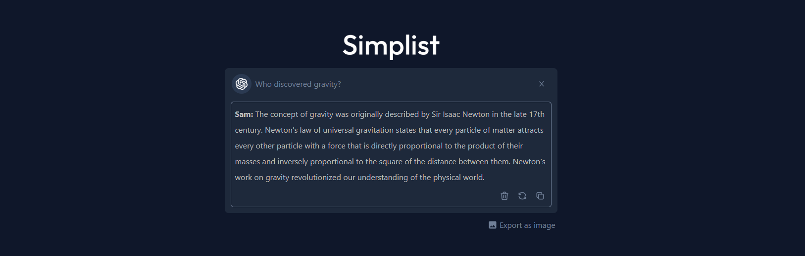

Simplist is an easy-to-use default page on your browser, giving you access to various search engines and the integration of IA which facilitates your searches by providing relevant results without overwhelming you with useless information.

You can export the result in a PNG file, regenerate the response or copy for paste in another page, in the future more features will be added.

**Simplist does not use any database** except for user accounts, which store the number of credits remaining (for IA).

### TODO:
- [ ] History of searches (IA) with Local Storage
- [X] Account creation and connection
- [X] Stripe integration for credits
